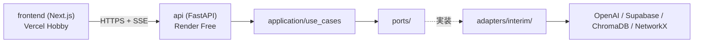

# 実装プラン（v4：Claude 全実装版）— Tech0 Search

作成日: 2026-05-12（v4: 学習スコープから Claude 全実装スコープへ転換）
対象: `../03_PROJECT_ZERO_要件定義書_ver07.docx` / `../04_PROJECT_ZERO_仕様設計書_ver03.docx`
位置づけ: 暫定環境（Vercel + Render Free + Supabase Free）に Streamlit MVP を移行する全実装プラン。本版は **Claude が全実装を担当**する前提で、学習配慮を撤廃しスループットを優先する。

## v4 主要変更点（v3 比）

| 項目 | v3（学習版） | v4（Claude 全実装版・本版） |
|---|---|---|
| 主体 | 開発者 3 名が実装、Claude はコーチ | **Claude が全実装** |
| 期間 | 1〜1.5 週間 | 1〜2 セッション |
| プロンプト | 新規設計 | **`mvp_streamlit/llm/prompts.py` を流用** |
| デザイン | 未指定（最低限） | **ダーク基調 HUD ＋ ネオン** |
| 検索可視化 | スコープ外 | **SSE パイプラインビュー必須** |
| Graph 表示 | 言及のみ | **react-force-graph-2d で必須** |
| Port-Adapter | 厳密に分離（学習目的） | 薄め（Service ↔ Adapter 直結許容） |
| 学習成果物 | 必須 | 不要 |
| デプロイ | スプリント末で実施 | **ローカル承認後**に実施 |

過去版は `archive/IMPLEMENTATION_PLAN_INTERIM_v1.md`（300 名 PoC）／`_v2.md`（MVP 反映）／`_v3.md`（学習版）として保存。

---

## 0. ゴール

ローカル `docker compose up` で以下が動く状態に到達する。

| # | 達成条件 |
|---|---|
| 1 | Next.js フロント（`localhost:3000`）にアイデア入力フォームが表示される |
| 2 | 送信後、SSE で検索パイプラインの各ステージ進捗がリアルタイム表示される |
| 3 | ChromaDB ヒット件数・NetworkX 展開ノード数が流れて表示される |
| 4 | LLM Stage1（3 軸スコア）と Stage2（提案 3 案＋承認者サマリー）が結果画面に表示される |
| 5 | 関連ノード Graph（react-force-graph-2d）が表示され、提案関連ノードがパルス強調される |
| 6 | 3 デモシナリオ（BEMS／医療／ウェアラブル）が MVP と同等の挙動で動く |

参考章: 要件§1／§4、仕様§1／§3／§5。

---

## 1. アーキテクチャ

### 1.1 採用パターン

| 方針 | 採用形態 | 根拠 |
|---|---|---|
| アプリ全体 | モジュラーモノリス | 仕様§1／要件§4.3 |
| 外部依存の抽象化 | Port-Adapter（薄め） | 要件§4.3「LLM プロバイダー切替をアダプタ交換のみで対応」 |
| API スタイル | REST + SSE | 仕様§3.1（REST）＋進捗ストリームのため SSE 併用 |

### 1.2 レイヤー構造



### 1.3 検索パイプライン（SSE ストリーム）

```
[INPUT] → [VECTORIZE] → [CHROMA SEARCH] → [GRAPH EXPAND] → [CONTEXT BUILD] → [LLM STAGE1] → [LLM STAGE2] → [DONE]
```

各ステージで `event: stage` を送出し、フロントで状態（pending／running／done／error）・経過時間・カウント（hits／nodes／tokens）を表示。

---

## 2. 暫定環境スタック（v3 から継承）

| 層 | サービス | プラン | 月額 |
|---|---|---|---|
| フロント | Vercel | Hobby | $0 |
| API | Render | Free Web Service | $0 |
| 業務 DB | Supabase | Free | $0 |
| ベクトル検索 | ChromaDB（インメモリ＋Supabase Storage 退避） | - | $0 |
| GraphRAG | NetworkX（インメモリ＋Supabase Storage 退避） | - | $0 |
| Blob | Supabase Storage | Free | $0 |
| LLM | OpenAI gpt-4o-mini | 従量 | $0〜$5 |
| OCR | Tesseract | OSS | $0 |
| **合計** | | | **$0〜$5／月** |

---

## 3. Port / Adapter 設計（薄め）

| Port 名 | Adapter（interim） | 流用元 |
|---|---|---|
| `LLMPort.stage1(theme, axis, context)` ／ `.stage2(...)` ／ `.tier2(...)` | `OpenAIAdapter` | `mvp_streamlit/llm/analyzer.py` ＋ `prompts.py` |
| `VectorSearchPort.search(query, n)` | `ChromaDBAdapter` | `mvp_streamlit/retrieval/vector_store.py` |
| `GraphRAGPort.get_neighbors(node_ids, depth)` ／ `.build_context(hits)` | `NetworkXAdapter` | `mvp_streamlit/retrieval/graph_search.py` |
| `KnowledgeStorePort.save_analysis(...)` ／ `.get_analysis(id)` | `SupabasePostgresAdapter` | 新規 |
| `BlobPort.upload`／`.download` | `SupabaseStorageAdapter` | 新規（ChromaDB／NetworkX スナップショット退避用） |
| `ProgressEmitterPort.emit(stage, status, payload)` | `SSEEmitterAdapter` | 新規（FastAPI EventSourceResponse） |

Service／UseCase 層は Port のみに依存。Azure 移行時は `adapters/azure/` を追加するだけ。

---

## 4. リポジトリ構造

```
tech0-search_claudecode/
├── apps/
│   ├── frontend/                       # Next.js 14 App Router + TS + Tailwind
│   │   ├── src/
│   │   │   ├── app/
│   │   │   │   ├── page.tsx            # アイデア入力フォーム
│   │   │   │   ├── analyses/[id]/page.tsx  # 結果＋Graph
│   │   │   │   └── layout.tsx
│   │   │   ├── components/
│   │   │   │   ├── PipelineView.tsx    # SSE タイムライン
│   │   │   │   ├── ScorePanel.tsx      # 3 軸スコア
│   │   │   │   ├── ProposalTabs.tsx
│   │   │   │   ├── ApproverSummary.tsx
│   │   │   │   └── GraphView.tsx       # react-force-graph-2d
│   │   │   ├── hooks/useAnalysisSSE.ts
│   │   │   ├── lib/api.ts
│   │   │   └── styles/globals.css      # ダーク HUD テーマ
│   │   ├── tailwind.config.ts
│   │   ├── package.json
│   │   └── Dockerfile
│   └── backend/                        # FastAPI
│       ├── src/
│       │   ├── api/
│       │   │   ├── analyses.py         # POST /analyses (SSE)
│       │   │   └── graph.py            # GET /graph/{id}
│       │   ├── application/
│       │   │   └── analyze_idea.py     # UseCase（パイプライン制御）
│       │   ├── domain/                 # エンティティ
│       │   ├── ports/                  # 抽象 IF
│       │   ├── adapters/interim/
│       │   │   ├── openai_llm.py       # prompts.py 流用
│       │   │   ├── chroma_search.py
│       │   │   ├── networkx_graph.py
│       │   │   ├── supabase_store.py
│       │   │   ├── supabase_blob.py
│       │   │   └── sse_emitter.py
│       │   ├── prompts.py              # mvp_streamlit からコピー
│       │   ├── infra/                  # DI・設定
│       │   └── main.py
│       ├── tests/
│       ├── pyproject.toml
│       └── Dockerfile
├── packages/
│   └── shared-types/                   # OpenAPI 3.0 YAML
├── infra/
│   └── docker-compose.yml              # frontend + backend + postgres
├── scripts/
│   ├── seed_supabase.py                # 既存
│   └── seed_chroma_networkx.py         # 新規（mvp data → Chroma／NetworkX）
├── supabase/migrations/
├── data/                               # 既存（external/internal/persons/graph）
├── mvp_streamlit/                      # 流用元（変更しない）
├── .github/workflows/ci.yml
├── .env.example
├── CLAUDE.md
├── IMPLEMENTATION_PLAN_INTERIM.md
└── README.md
```

---

## 5. デザイン方針（テクノロジー感）

### 5.1 配色

| 用途 | カラー |
|---|---|
| 背景 | `#0A0E1A`（深紺） |
| パネル | `#101728` |
| ボーダー | `#1F2A44` |
| テキスト | `#E5ECFF` |
| サブテキスト | `#8B97B8` |
| Accent 1（シアン） | `#00E5FF` |
| Accent 2（マゼンタ） | `#FF2D95` |
| Success | `#00FFA3` |
| Warning | `#FFB800` |
| Error | `#FF4D6D` |

### 5.2 タイポグラフィ

| 用途 | フォント |
|---|---|
| UI 全般 | Inter（変動ウェイト） |
| 数値・ID・スコア | JetBrains Mono |
| 見出し | Inter Bold ＋ tracking-wider |

### 5.3 視覚効果

| 要素 | 仕様 |
|---|---|
| 背景 | 微細 SVG グリッド（`#1F2A44` 1px、48px ピッチ）＋ Radial Gradient ＋ ノイズテクスチャ |
| パネル | 角丸 12px ＋ ボーダー ＋ 内側上部に 1px シアングロー（border-top） |
| ボタン | ホバーで cyan/magenta グロー（`box-shadow: 0 0 24px #00E5FF55`） |
| アニメ | Framer Motion で fade+slide（150〜250ms）、スコアはカウントアップ |
| ステータス LED | パイプライン各ステージに `running` 時パルスドット |

---

## 6. 検索処理の視覚化（SSE）

### 6.1 イベントスキーマ

```ts
type StageEvent = {
  event: "stage";
  data: {
    stage: "VECTORIZE" | "CHROMA" | "GRAPH" | "CONTEXT" | "LLM_STAGE1" | "LLM_STAGE2";
    status: "pending" | "running" | "done" | "error";
    elapsed_ms: number;
    payload?: {
      hits?: Array<{id: string; content: string; score: number; source: string}>;
      nodes?: Array<{id: string; type: string}>;
      tokens?: number;
      error?: string;
    };
  };
};
type ResultEvent = {event: "result"; data: AnalysisResult};
```

### 6.2 フロント表示

| 要素 | 表示 |
|---|---|
| ステージカード | 横並び 6 枚（パイプライン）。各カードに icon／name／status LED／elapsed |
| ヒット流れ | CHROMA カード内に件数バッジ、ホバーで上位 5 件を JetBrains Mono で展開 |
| トークン | LLM ステージは応答トークン数を毎 500ms 更新 |
| 失敗 | 該当カードが赤グロー、下に折りたたみエラー JSON |

---

## 7. 関連ノード Graph

| 項目 | 仕様 |
|---|---|
| ライブラリ | `react-force-graph-2d` |
| API | `GET /api/v1/graph/{analysis_id}` → `{nodes: [...], edges: [...]}` |
| ノードタイプ別配色 | tech=`#00E5FF`／person=`#FF2D95`／market=`#FFB800`／failure=`#FF4D6D` |
| サイズ | ChromaDB スコア ＋ 提案関連度で決定 |
| パルス | 提案 3 案で参照されたノードは 2 秒周期でグロー |
| インタラクション | クリック→右サイドパネル詳細／ホバー→隣接エッジ強調／マウスホイールでズーム |

---

## 8. 5 フェーズ実行プラン

| Phase | 内容 | 想定時間 | 完了条件 |
|---|---|---|---|
| **F0** | プロジェクト初期化（monorepo 雛形・docker-compose・.env・CI） | 30 分 | `docker compose up` で frontend と backend が立ち上がる |
| **F1** | バックエンド（Port-Adapter・UseCase・API・データ投入スクリプト） | 2〜3 時間 | `POST /api/v1/analyses` が SSE で MVP と同等出力を返す |
| **F2** | フロントエンド（ダーク HUD デザイン・フォーム・結果画面骨格） | 2〜3 時間 | アイデア入力 → 結果画面遷移が動く（ダミーデータでも可） |
| **F3** | SSE パイプラインビュー（リアルタイム進捗表示） | 1〜2 時間 | 6 ステージのカードが SSE で順次 done 化する |
| **F4** | Graph 表示（react-force-graph-2d） | 1〜2 時間 | 結果画面下部に Graph が表示され、提案関連ノードがパルス |
| **F5** | E2E ＋ デモ 3 シナリオ確認 → **ユーザー承認** → デプロイ | 1〜2 時間 | 3 シナリオが MVP と整合／ユーザーの承認後に Vercel／Render／Supabase へ |

---

## 9. データ移行

| Source | Destination | スクリプト |
|---|---|---|
| `mvp_streamlit/data/external.json`／`internal.json`／`persons.json` | ChromaDB コレクション `documents` | `scripts/seed_chroma_networkx.py` |
| `data/graph/nodes.json`／`edges.json` | NetworkX gpickle → Supabase Storage | 同上 |
| 分析履歴 | Supabase Postgres `analyses` テーブル | `scripts/seed_supabase.py`（既存）＋ UseCase 経由 |

---

## 10. 受入基準

| # | 項目 | 達成条件 |
|---|---|---|
| 1 | ローカル E2E | `docker compose up` から `localhost:3000` で「アイデア入力 → 検索可視化 → 結果＋Graph」が動く |
| 2 | プロンプト整合 | `mvp_streamlit/llm/prompts.py` を流用、改変は 0 行〜最小 |
| 3 | デザイン | ダーク基調＋ネオン HUD で見た目がテクノロジー感を持つ |
| 4 | 検索可視化 | SSE 6 ステージのタイムラインが正常表示 |
| 5 | Graph | 関連ノードが力学レイアウトで表示、提案関連がパルス強調 |
| 6 | デモシナリオ | BEMS GO／医療 GO／ウェアラブル NO の 3 結果が MVP と整合 |

### 10.1 スコープ外

| 項目 | 扱い |
|---|---|
| 性能 SLO（仕様§14） | 測定しない（Azure 移行時） |
| 本番認証（Entra ID） | None Adapter のまま |
| 監査ログ厳格化／楽観ロック | 簡易ログのみ |
| 負荷試験 | 不要 |
| キャッシュ層 | 不要（必要時に Upstash 追加） |

---

## 11. デプロイ承認フロー

```
F4 完了
   ↓
Claude が「ローカル E2E 動作確認できる状態です」と報告
   ↓
ユーザーがローカルで動作確認
   ↓
ユーザー承認（「デプロイして OK」等）
   ↓
F5 デプロイ実行（Vercel／Render／Supabase）
   ↓
本番 URL を報告
```

承認なしでのデプロイは禁止。

---

## 12. リスク・前提

| リスク | 対処 |
|---|---|
| Render Free コールドスタート 30 秒 | デモ前にウォームアップ叩く運用ルール |
| ChromaDB／NetworkX 起動時再構築 | 数 MB 規模で数秒以内に収まる前提 |
| OpenAI キー個人負担 | ユーザーが `.env` に設定。月額上限 $5 推奨 |
| Supabase Free 7 日無アクセス停止 | 週 1 アクセス運用 |
| 認証なしでの暴露 | Render Basic Auth ＋ 社内限定 URL ＋ ダミーデータのみ投入 |

---

## 13. 参考資料

| 文書 | バージョン | 主な参照 |
|---|---|---|
| 要件定義書 | ver07 | §1／§4／§7 |
| 仕様設計書 | ver03 | §1／§3／§5 |
| 過去版 | v1（300 名 PoC）／v2（MVP 反映）／v3（学習版） | `archive/` |
| MVP | `mvp_streamlit/` | プロンプト・データ・ロジック流用元 |
